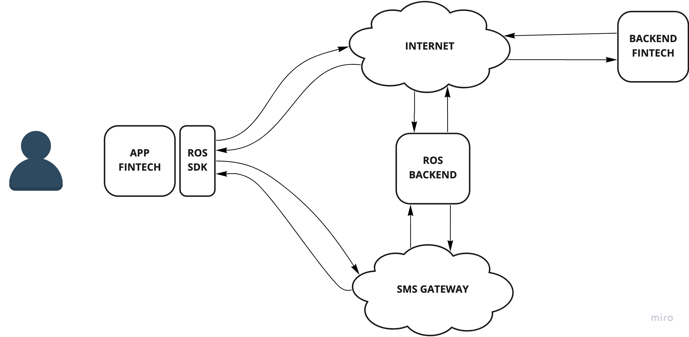

# ROS-GATEWAY

Proyecto desarrollado para el hackit-ba 2022 por Maximiliano Zitelli, Tobias Lifschitz y Santiago Ivulich.

## Resumen

Este gateway permite la interacción por SMS utilizando el protocólo ROS para habilitar 
consultas HTTP a través de SMS.

## Arquitectura
Nuestro SDK se integra directamente con la app de los clientes y deriva las
consultas por el medio adecuado. 

En el caso de tener internet las consultas son enviadas por HTTP 
tradicional al servidor del cliente.

En el caso de no poseer internet las consultas son transmitidas por el protocolo
ROS a nuestros servidores y luego enviadas al servidor del cliente.

## Protocolo ROS
El protocolo ROS permite serializar los datos y transmitirlos por mensaje
siguiendo los siguientes pasos:

 1) Se compila el JSON a protobuf.
 2) Se comprime el binario del protobuf.
 3) Se encriptan los datos comprimidos.
 4) Se codifican en base64.

